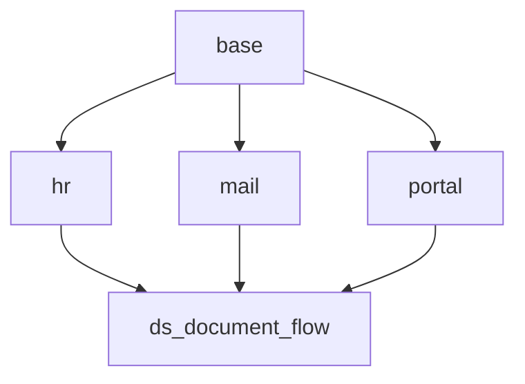
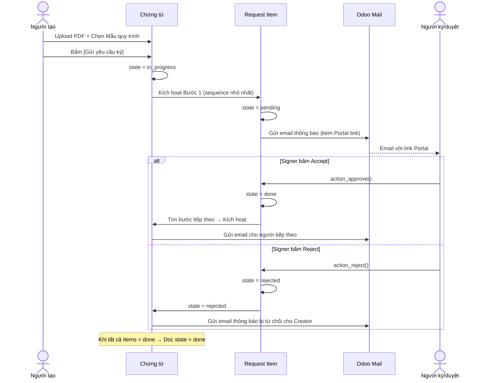
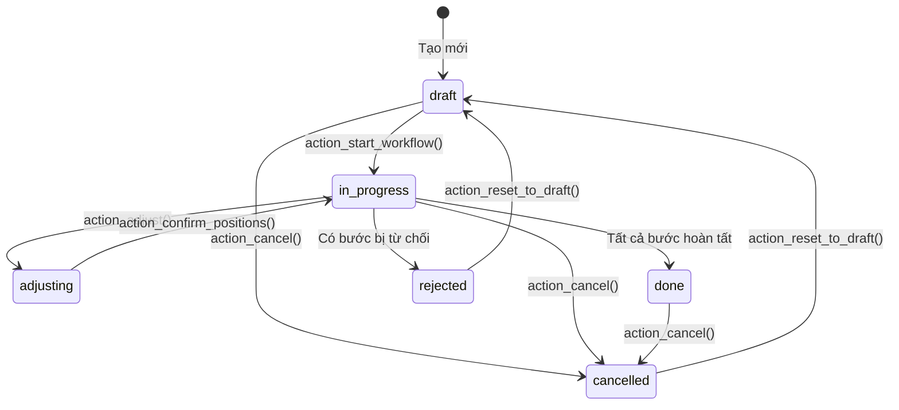
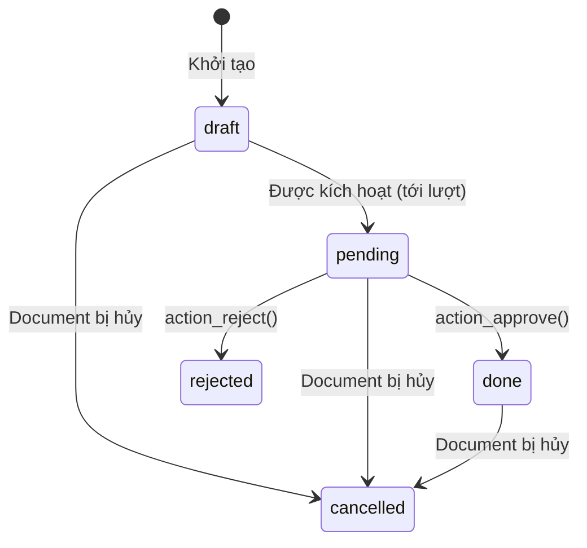
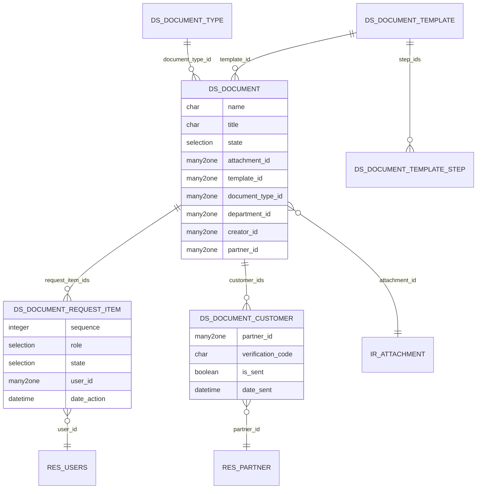

# 📦 Module Specification: `ds_document_flow`

> **Module Name:** `ds_document_flow`
> **Display Name:** Dochub – Document Signing Flow
> **Version:** 19.0.1.0.0
> **Category:** Document Management
> **Depends:** `base`, `hr`, `mail`, `portal`
> **License:** LGPL-3

## 1. Tổng quan

Module quản lý luồng trình ký chứng từ tuần tự (Sequential Signing Workflow). Cho phép tạo chứng từ đính kèm file PDF, thiết lập quy trình nhiều bước (ký số / phê duyệt), gửi email tự động theo từng bước, và xử lý logic Accept / Reject / Reset.

> [!IMPORTANT]
> **Phase 1 Focus:** Chỉ xây luồng định tuyến và phê duyệt. Hành động "Ký số" tạm thời là nút bấm Accept trên Web. Việc tích hợp USB Token / Cloud CA (VNPT, MISA) sẽ triển khai ở Phase 2.

---

## 2. Module Dependency Graph



> **Quyết định kiến trúc:** Thêm `hr` vì model sử dụng `hr.department` cho field `department_id`. Gộp thành 1 module vì tất cả models thuộc cùng domain nghiệp vụ.

---

## 3. Luồng Hoạt Động (Workflow)



### State Machine — Chứng từ (`ds.document`)



### State Machine — Request Item (`ds.document.request.item`)



---

## 4. Data Models

### 4.1 `ds.document` — Chứng từ gốc

> `_description = 'Document'` · `_inherit = ['mail.thread', 'mail.activity.mixin', 'portal.mixin']` · `_order = 'create_date desc'`

**Group A — Thông Tin Chứng Từ:**

| # | Field | Type | Attributes | Mô tả |
|---|-------|------|------------|-------|
| 1 | `name` | Char | `required=True, copy=False, readonly=True, default='New'` | Số chứng từ (auto-sequence) |
| 2 | `title` | Char | `required=True` | Tiêu đề chứng từ |
| 3 | `description` | Text | | Mô tả / ghi chú |
| 4 | `document_type_id` | Many2one | `comodel_name='ds.document.type', required=True` | Loại chứng từ |
| 5 | `department_id` | Many2one | `comodel_name='hr.department'` | Bộ phận |
| 6 | `related_document_id` | Many2one | `comodel_name='ds.document'` | Chứng từ liên quan |
| 7 | `coordinator_id` | Many2one | `comodel_name='res.users'` | Người điều phối |
| 8 | `viewer_ids` | Many2many | `comodel_name='res.users'` | Nhân viên được xem chứng từ |

**Group B — Tệp Chứng Từ:**

| # | Field | Type | Attributes | Mô tả |
|---|-------|------|------------|-------|
| 9 | `attachment_id` | Many2one | `comodel_name='ir.attachment', required=True` | File PDF chính |
| 10 | `signed_attachment_id` | Many2one | `comodel_name='ir.attachment'` | File PDF đã ký (Phase 2) |
| 11 | `related_attachment_ids` | Many2many | `comodel_name='ir.attachment'` | Tài liệu liên quan (phụ) |
| 12 | `password` | Char | | Mật khẩu bảo vệ file (nếu có) |
| 13 | `auto_sign_position` | Selection | `[('above', 'Above Signature'), ('below', 'Below Signature'), ('custom', 'Custom')]` | Vị trí chữ ký tự động |
| 14 | `render_mode` | Selection | `[('signature_only', 'Signature Only'), ('full', 'Full Display')]` | Chế độ hiển thị |

**Group C — Thông tin Thời Gian & Khách Hàng:**

| # | Field | Type | Attributes | Mô tả |
|---|-------|------|------------|-------|
| 15 | `date_deadline` | Date | | Ngày hết hạn xử lý |
| 16 | `date_effective_from` | Date | | Hiệu lực từ ngày |
| 17 | `date_effective_to` | Date | | Hiệu lực đến ngày |
| 18 | `partner_id` | Many2one | `comodel_name='res.partner'` | Khách hàng |
| 19 | `contract_value` | Monetary | | Giá trị hợp đồng |
| 20 | `currency_id` | Many2one | `comodel_name='res.currency'` | Tiền tệ |

**Group D — Workflow & System:**

| # | Field | Type | Attributes | Mô tả |
|---|-------|------|------------|-------|
| 21 | `state` | Selection | `default='draft', tracking=True` | `draft`, `in_progress`, `adjusting`, `done`, `rejected`, `cancelled` |
| 22 | `template_id` | Many2one | `comodel_name='ds.document.template'` | Mẫu quy trình áp dụng |
| 23 | `request_item_ids` | One2many | `comodel_name='ds.document.request.item', inverse_name='document_id'` | Danh sách lượt ký/duyệt |
| 24 | `customer_ids` | One2many | `comodel_name='ds.document.customer', inverse_name='document_id'` | Danh sách KH nhận thông báo |
| 25 | `creator_id` | Many2one | `comodel_name='res.users', default=lambda self: self.env.user` | Người tạo chứng từ |
| 26 | `company_id` | Many2one | `comodel_name='res.company', default=lambda self: self.env.company` | Công ty |
| 27 | `date_request` | Datetime | | Ngày gửi yêu cầu ký |
| 28 | `date_done` | Datetime | | Ngày hoàn tất |
| 29 | `cancel_reason` | Text | | Lý do hủy chứng từ |
| 30 | `cancel_user_id` | Many2one | `comodel_name='res.users'` | Người hủy |
| 31 | `cancel_date` | Datetime | | Thời điểm hủy |
| 32 | `current_signer_id` | Many2one | `comodel_name='res.users', compute='_compute_current_signer'` | Người đang ký hiện tại |
| 33 | `current_signer_state` | Selection | `compute='_compute_current_signer'` | Trạng thái bước hiện tại |
| 34 | `item_count` | Integer | `compute='_compute_item_count'` | Tổng số bước |
| 35 | `item_done_count` | Integer | `compute='_compute_item_count'` | Số bước đã xong |

**Kế thừa:** `mail.thread`, `mail.activity.mixin`, `portal.mixin`
**`_rec_name`:** `'name'`
**`_order`:** `'create_date desc'`

**Methods chính:**

| Method | Mô tả |
|--------|-------|
| `action_start_workflow()` | Nút **[Khởi tạo quy trình]**: Validate → Chuyển `in_progress` → Kích hoạt bước 1 |
| `action_send_workflow()` | Nút **[Gửi quy trình]**: Gửi email cho bước đang pending |
| `action_adjust()` | Nút **[Đặt vị trí ký]**: Chuyển state `adjusting` để kéo thả  |
| `action_reset_positions()` | Nút **[Reset vị trí ký]**: Xóa tọa độ vị trí ký |
| `action_confirm_positions()` | Hoàn tất hiệu chỉnh → quay lại `in_progress` |
| `action_publish()` | Nút **[Ban hành kết quả]**: Gửi mail cho tất cả KH trong `customer_ids` |
| `action_request_resign()` | Nút **[Yêu cầu ký lại]**: Reset các bước và gửi lại |
| `action_cancel()` | Mở wizard `ds.document.cancel` yêu cầu nhập lý do → Hủy CT + tất cả items → Ghi cancel log vào chatter |
| `action_reset_to_draft()` | Reset về nháp |
| `action_share()` | Nút **[Chia sẻ tài liệu]**: Tạo portal link |
| `apply_template()` | Nút **[Tải quy trình]**: Áp dụng mẫu quy trình |
| `save_as_template()` | Nút **[Lưu mẫu quy trình]**: Lưu cấu hình hiện tại thành mẫu |
| `_activate_next_step()` | Logic kích hoạt bước tiếp theo |
| `_check_workflow_complete()` | Logic kiểm tra hoàn tất |

---

### 4.2 `ds.document.type` — Loại chứng từ

> `_description = 'Document Type'`

Phân loại chứng từ (VD: Hợp đồng, Tờ trình, Biên bản).

| # | Field | Type | Attributes | Mô tả |
|---|-------|------|------------|-------|
| 1 | `name` | Char | `required=True` | Tên loại chứng từ |
| 2 | `code` | Char | | Mã loại (viết tắt) |
| 3 | `sequence_id` | Many2one | `comodel_name='ir.sequence'` | Sequence tự đánh số chứng từ |
| 4 | `default_template_id` | Many2one | `comodel_name='ds.document.template'` | Mẫu quy trình mặc định |

---

### 4.3 `ds.document.template` — Mẫu quy trình ký

> `_description = 'Document Template'`

Lưu sẵn các bước trình ký để tái sử dụng.

| # | Field | Type | Attributes | Mô tả |
|---|-------|------|------------|-------|
| 1 | `name` | Char | `required=True` | Tên mẫu quy trình |
| 2 | `description` | Text | | Mô tả |
| 3 | `active` | Boolean | `default=True` | Lưu trữ (Odoo auto-filter khi `False`) |
| 4 | `step_ids` | One2many | `comodel_name='ds.document.template.step', inverse_name='template_id'` | Danh sách bước |
| 5 | `company_id` | Many2one | `comodel_name='res.company'` | Công ty |

---

### 4.4 `ds.document.template.step` — Chi tiết bước trong mẫu

> `_description = 'Document Template Step'` · `_order = 'sequence, id'`

| # | Field | Type | Attributes | Mô tả |
|---|-------|------|------------|-------|
| 1 | `template_id` | Many2one | `comodel_name='ds.document.template', required=True, ondelete='cascade'` | Template cha |
| 2 | `sequence` | Integer | `default=10` | Thứ tự bước |
| 3 | `name` | Char | `required=True` | Tên bước (VD: "Trưởng phòng ký") |
| 4 | `role` | Selection | `[('sign', 'Ký số'), ('approve', 'Phê duyệt')]` | Loại hành động |
| 5 | `user_id` | Many2one | `comodel_name='res.users'` | Người thực hiện (cố định) |
| 6 | `is_external` | Boolean | `default=False` | Người ký bên ngoài (portal)? |
| 7 | `partner_id` | Many2one | `comodel_name='res.partner'` | Đối tác bên ngoài (nếu external) |

---

### 4.5 `ds.document.request.item` — Chi tiết lượt ký/duyệt (Cốt lõi Workflow)

Bảng "Quy trình nội bộ" trên giao diện. Mỗi dòng = 1 bước trong quy trình của 1 chứng từ cụ thể.

| # | Field | Type | Attributes | Mô tả |
|---|-------|------|------------|-------|
| 1 | `document_id` | Many2one | `comodel_name='ds.document', required=True, ondelete='cascade'` | Chứng từ cha |
| 2 | `sequence` | Integer | `default=10` | Thứ tự xử lý |
| 3 | `name` | Char | | Tên bước |
| 4 | `role` | Selection | `[('sign', 'Ký số'), ('approve', 'Phê duyệt')]` | Loại hành động |
| 5 | `user_id` | Many2one | `comodel_name='res.users'` | User nội bộ thực hiện |
| 6 | `partner_id` | Many2one | `comodel_name='res.partner'` | Partner (portal) |
| 7 | `email` | Char | `related='partner_id.email'` | Email người nhận |
| 8 | `phone` | Char | `related='partner_id.phone'` | Số điện thoại |
| 9 | `state` | Selection | `default='draft', tracking=True` | `draft`, `pending`, `done`, `rejected`, `cancelled` |
| 10 | `date_sent` | Datetime | | Thời điểm gửi yêu cầu ký |
| 11 | `date_action` | Datetime | | Thời điểm ký/duyệt xong |
| 12 | `transaction_id` | Char | | Mã giao dịch từ API nhà mạng (Phase 2) |
| 13 | `document_hash` | Char | | Mã Hash tài liệu tại thời điểm ký (Phase 2) |
| 14 | `note` | Text | | Ghi chú khi duyệt/từ chối |
| 15 | `access_token` | Char | `copy=False` | Token truy cập Portal |
| 16 | `is_current_user` | Boolean | `compute='_compute_is_current_user'` | User đang login = người thực hiện? |
| 17 | `signature_pos_x` | Float | | *(Phase 2)* Tọa độ X chữ ký |
| 18 | `signature_pos_y` | Float | | *(Phase 2)* Tọa độ Y chữ ký |
| 19 | `page_number` | Integer | `default=1` | *(Phase 2)* Trang PDF đặt chữ ký |

> `_description = 'Document Request Item'` · `_order = 'sequence, id'` · **Không kế thừa `mail.thread`** (child record — log vào chatter của parent `ds.document`)

**Methods chính:**

| Method | Mô tả |
|--------|-------|
| `action_approve()` | Nút **[Hoàn tất]** / **[Ký]**: state → `done`, ghi `date_action`, gọi `_activate_next_step()` |
| `action_reject()` | Nút **[Từ chối]**: state → `rejected`, ghi lý do, post chatter |
| `action_request_resign()` | Nút **[Yêu cầu ký lại]**: Reset bước hiện tại + các bước trước |
| `_send_notification_email()` | Gửi mail template kèm Portal link |
| `_compute_is_current_user()` | Hiện/ẩn nút action động trên UI |

---

### 4.6 `ds.document.customer` — Danh sách khách hàng nhận chứng từ

Bảng "Quy trình khách hàng" — sau khi chứng từ hoàn tất, Người điều phối chọn khách hàng để gửi mail thông báo kèm mã xác thực.

| # | Field | Type | Attributes | Mô tả |
|---|-------|------|------------|-------|
| 1 | `document_id` | Many2one | `comodel_name='ds.document', required=True, ondelete='cascade'` | Chứng từ cha |
| 2 | `partner_id` | Many2one | `comodel_name='res.partner', required=True` | Khách hàng |
| 3 | `email` | Char | `store=True, readonly=False` | Email gửi thông báo (default từ partner, cho phép override) |
| 4 | `phone` | Char | `related='partner_id.phone'` | Số điện thoại |
| 5 | `verification_code` | Char | `default=_generate_code, copy=False` | Mã xác thực 6 ký tự (tự động sinh) |
| 6 | `is_sent` | Boolean | `default=False` | Đã gửi mail chưa? |
| 7 | `date_sent` | Datetime | | Thời điểm gửi mail |

**Methods:**

| Method | Mô tả |
|--------|-------|
| `_generate_code()` | Tạo mã ngẫu nhiên 6 ký tự (chữ + số) VD: `IYMPL7`, `Ab12Cd` |
| `action_send_customer_email()` | Gửi mail template thông báo kèm mã xác thực cho khách hàng |
| `action_preview()` | Nút **[Xem trước]**: Mở portal page như góc nhìn khách hàng |

---

## 5. Entity Relationship Diagram



---

## 6. Views

### 6.1 `ds.document` Form View

**Header Buttons (Hiển thị có điều kiện theo state):**
- `draft`: **[Khởi tạo quy trình]**
- `in_progress`: **[Gửi yêu cầu ký]** **[Hoàn tất]** **[Từ chối]** **[Yêu cầu ký lại]** **[Hủy chứng từ]**
- `adjusting`: **[Đặt vị trí ký]** **[Reset vị trí ký]** **[Gửi quy trình]**
- `done`: **[Ban hành kết quả]** **[Hủy chứng từ]**
- `rejected`: **[Đưa về nháp]**
- `cancelled`: **[Đưa về nháp]**
- Statusbar: `draft` → `in_progress` → `adjusting` → `done` → `rejected` → `cancelled`

**Layout (2 cột chính):**
- **Cột trái:** Thông tin CT (Tiêu đề, Loại, Bộ phận, Chứng từ liên quan, Mô tả, Người điều phối, Nhân viên xem)
- **Cột phải:** Tệp chứng từ (File đính kèm, Tài liệu liên quan, Render mode, Auto sign position, Mật khẩu)
- **Dưới cùng bên trái:** Thông tin thời gian (Deadline, Hiệu lực từ/đến)
- **Dưới cùng bên phải:** Thông tin khách hàng (Tên, Mã KH, Giá trị HĐ)
- **Nút chia sẻ:** **[Chia sẻ tài liệu]**

**Notebook Tabs:**
1. **Thông tin** — Hiển thị form fields chính
2. **Quy trình nội bộ** — Tree editable `request_item_ids` + nút **[Lưu mẫu quy trình]** **[Tải quy trình]**
3. **Quy trình khách hàng** *(chỉ hiện khi state = `done`)* — Tree editable `customer_ids` (Khách hàng, Email, Phone, Mã xác thực, **[Xem trước]**)

**Khi ở state `in_progress`:** Hiển thị thêm section "THÔNG TIN NGƯỜI KÝ" và Tab "Lịch sử ký".
**Khi ở state `done`:** Hiển thị thêm Tab "Quy trình khách hàng" và nút **[Ban hành kết quả]** gửi mail cho tất cả khách hàng trong danh sách.

### 6.2 `ds.document` Tree View

| Cột | Mô tả |
|-----|-------|
| Mã chứng từ | `name` |
| Tiêu đề chứng từ | `title` |
| Loại chứng từ | `document_type_id` |
| Bộ phận | `department_id` |
| Khách hàng | `partner_id` |
| Ngày hết hạn xử lý | `date_deadline` |
| Trạng thái | `state` (badge colors) |

### 6.3 Menus

```
📁 Dochub (ds_document_flow)
├── 📄 Chứng từ (ds.document)
├── 📂 Danh sách file ký (ds.document — filter: state=in_progress)
├── ✍️ Ký hàng loạt (wizard: batch sign)
├── ✅ Duyệt hàng loạt (wizard: batch approve)
├── ⚙️ Cấu hình
│   ├── 📋 Mẫu quy trình (ds.document.template)
│   └── 🏷️ Loại chứng từ (ds.document.type)
```

---

## 7. Security

### 7.1 Groups

| Group XML ID | Tên | Implied Group |
|-------------|-----|---------------|
| `group_ds_user` | Nhân viên trình ký | `base.group_user` |
| `group_ds_manager` | Quản lý trình ký | `group_ds_user` |

### 7.2 ACL Matrix (`ir.model.access.csv`)

| Model | Group | Read | Write | Create | Unlink |
|-------|-------|------|-------|--------|--------|
| `ds.document` | `group_ds_user` | ✅ | ✅ | ✅ | ❌ |
| `ds.document` | `group_ds_manager` | ✅ | ✅ | ✅ | ✅ |
| `ds.document.type` | `group_ds_user` | ✅ | ❌ | ❌ | ❌ |
| `ds.document.type` | `group_ds_manager` | ✅ | ✅ | ✅ | ✅ |
| `ds.document.template` | `group_ds_user` | ✅ | ❌ | ❌ | ❌ |
| `ds.document.template` | `group_ds_manager` | ✅ | ✅ | ✅ | ✅ |
| `ds.document.template.step` | `group_ds_user` | ✅ | ❌ | ❌ | ❌ |
| `ds.document.template.step` | `group_ds_manager` | ✅ | ✅ | ✅ | ✅ |
| `ds.document.request.item` | `group_ds_user` | ✅ | ✅ | ✅ | ❌ |
| `ds.document.request.item` | `group_ds_manager` | ✅ | ✅ | ✅ | ✅ |
| `ds.document.customer` | `group_ds_user` | ✅ | ✅ | ✅ | ❌ |
| `ds.document.customer` | `group_ds_manager` | ✅ | ✅ | ✅ | ✅ |
| `ds.document.cancel` | `group_ds_user` | ✅ | ✅ | ✅ | ❌ |
| `ds.document.batch.sign` | `group_ds_user` | ✅ | ✅ | ✅ | ❌ |
| `ds.document.batch.approve` | `group_ds_user` | ✅ | ✅ | ✅ | ❌ |

### 7.3 Record Rules

| Rule | Model | Domain | Groups |
|------|-------|--------|--------|
| User thấy CT của mình tạo / điều phối / xem / ký | `ds.document` | `['\|', '\|', '\|', ('creator_id', '=', user.id), ('coordinator_id', '=', user.id), ('viewer_ids', 'in', user.id), ('request_item_ids.user_id', '=', user.id)]` | `group_ds_user` |
| Manager thấy tất cả | `ds.document` | `[(1, '=', 1)]` | `group_ds_manager` |

---

## 8. Data & Sequences

- **`ir.sequence`** cho `ds.document`: prefix `DS-`, padding 5 (VD: `DS-00001`).
- **Mail Template** `mail_template_request_item_notify`: Email thông báo có chứng từ cần ký/duyệt, kèm link Portal.
- **Mail Template** `mail_template_document_rejected`: Email thông báo chứng từ bị từ chối.
- **Mail Template** `mail_template_document_done`: Email thông báo chứng từ đã hoàn tất.
- **Mail Template** `mail_template_customer_notify`: Email thông báo cho khách hàng (branded HTML). Chứa bảng: Tên CT, Mã CT, Mã khách hàng (verification_code), Ngày tạo, Số tài liệu. Nút **[Xem Chi Tiết Chứng Từ]** link đến portal route.

---

## 9. Controller (Portal & Public)

### 9.1 Internal Workflow (Phase 1 — chỉ user nội bộ)
| Route | Auth | Mô tả |
|-------|------|-------|
| `/my/documents` | `user` | Danh sách chứng từ của portal user |
| `/my/document/<int:document_id>` | `public` | Chi tiết chứng từ (cần `access_token`) |
| `/my/document/<int:document_id>/approve` | `public` | POST action duyệt |
| `/my/document/<int:document_id>/reject` | `public` | POST action từ chối |

### 9.2 Customer Notification Portal (Khách hàng xem chứng từ đã ký)
| Route | Auth | Mô tả |
|-------|------|-------|
| `/document/view/<access_token>` | `public` | Trang thông tin chứng từ công khai: Tên CT, Mã CT, Đối tác + Danh sách file kèm nút **[Xem file]** |
| `/document/verify/<access_token>/<int:attachment_id>` | `public` | Trang xác thực: Yêu cầu nhập mã 6 ký tự. `POST` gửi mã → Server so sánh với `verification_code` → đúng: lưu vào session + redirect xem file. Sai: hiển thị lỗi. |
| `/document/download/<access_token>/<int:attachment_id>` | `public` | Download/Inline view file PDF. Chỉ cho phép nếu session đã xác thực. |

### 9.3 QWeb Portal Templates

| Template XML ID | Mô tả |
|-----------------|-------|
| `ds_portal_document_detail` | Trang thông tin CT công khai: Header xanh (Tên, Mã, Đối tác) + Bảng "Danh sách" (STT, Mã, Tên file, Ngày tạo, Nút [Xem file]) |
| `ds_portal_verify_code` | Trang xác thực mã: Centered card với logo, hướng dẫn, input 6 ký tự, nút [Xác thực và xem tài liệu], footer "Cần hỗ trợ?" |

## 10. Module Structure

```
ds_document_flow/
├── __init__.py
├── __manifest__.py
├── models/
│   ├── __init__.py
│   ├── ds_document.py
│   ├── ds_document_type.py
│   ├── ds_document_template.py
│   ├── ds_document_request_item.py
│   └── ds_document_customer.py
├── wizard/
│   ├── __init__.py
│   ├── ds_document_cancel.py
│   ├── ds_document_cancel_views.xml
│   ├── ds_document_batch_sign.py
│   └── ds_document_batch_sign_views.xml
├── views/
│   ├── ds_document_views.xml
│   ├── ds_document_type_views.xml
│   ├── ds_document_template_views.xml
│   ├── ds_document_menus.xml
│   └── ds_document_portal_templates.xml
├── security/
│   ├── security.xml
│   └── ir.model.access.csv
├── controllers/
│   ├── __init__.py
│   └── portal.py
├── data/
│   ├── sequence_data.xml
│   └── mail_template_data.xml
├── static/
│   └── description/
│       └── icon.png
├── i18n/
│   └── vi_VN.po
└── tests/
    ├── __init__.py
    └── test_ds_document.py
```

---

## 11. Test Plan

| Test Case | Class | Mô tả |
|-----------|-------|-------|
| `test_create_document` | `TestDsDocument` | Tạo chứng từ, verify state = draft |
| `test_start_workflow` | `TestDsDocument` | Gửi yêu cầu ký → item đầu tiên = pending, còn lại = draft |
| `test_approve_step` | `TestDsDocument` | Approve bước 1 → bước 2 tự chuyển pending |
| `test_reject_step` | `TestDsDocument` | Reject bước 2 → document state = rejected |
| `test_reset_to_draft` | `TestDsDocument` | Reset → tất cả items về draft |
| `test_workflow_complete` | `TestDsDocument` | Approve tất cả → document state = done |
| `test_apply_template` | `TestDsDocument` | Chọn template → items tự động tạo theo step_ids |
| `test_cancel_with_reason` | `TestDsDocument` | Hủy CT đã hoàn tất → wizard lý do → state cancelled, items cancelled |
| `test_cancel_reset_to_draft` | `TestDsDocument` | Hủy → [Đưa về nháp] → state draft |
| `test_customer_notification` | `TestDsDocumentCustomer` | Thêm KH → Ban hành → verify mail gửi + mã xác thực |
| `test_access_rights` | `TestDsDocumentAccess` | User chỉ thấy CT liên quan, Manager thấy tất cả |

---

## 12. Wizards

### 12.1 `ds.document.batch.sign` (TransientModel)
*Wizard "Ký hàng loạt" — cho phép user chọn nhiều chứng từ và ký/duyệt tất cả cùng lúc.*

| # | Field | Type | Mô tả |
|---|-------|------|-------|
| 1 | `document_ids` | Many2many | `comodel_name='ds.document'` — Từ context active_ids |
| 2 | `note` | Text | Ghi chú chung |

| Method | Mô tả |
|--------|-------|
| `action_batch_approve()` | Duyệt bước đang pending của user hiện tại trên từng document |

### 12.2 `ds.document.batch.approve` (TransientModel)
*Wizard "Duyệt hàng loạt" — tương tự batch sign nhưng cho role `approve`.*

### 12.3 `ds.document.cancel` (TransientModel)
*Wizard "Hủy chứng từ" — popup yêu cầu nhập lý do trước khi hủy.*

| # | Field | Type | Attributes | Mô tả |
|---|-------|------|------------|-------|
| 1 | `document_id` | Many2one | `comodel_name='ds.document'` | Chứng từ cần hủy (từ context) |
| 2 | `reason` | Text | `required=True` | Lý do hủy |

| Method | Mô tả |
|--------|-------|
| `action_confirm_cancel()` | Ghi `cancel_reason`, `cancel_user_id`, `cancel_date` vào document → Đổi state document + tất cả items → `cancelled` → Post message chi tiết vào chatter (Người hủy, Thời gian, Lý do) |

---

## 13. Manifest (`__manifest__.py`)

```python
{
    'name': 'Dochub - Document Signing Flow',
    'version': '18.0.1.0.0',
    'category': 'Document Management',
    'summary': 'Quản lý luồng trình ký chứng từ tuần tự với nhiều bước ký số/phê duyệt',
    'depends': ['base', 'hr', 'mail', 'portal'],
    'data': [
        # Security
        'security/security.xml',
        'security/ir.model.access.csv',
        # Data
        'data/sequence_data.xml',
        'data/mail_template_data.xml',
        # Views
        'views/ds_document_views.xml',
        'views/ds_document_type_views.xml',
        'views/ds_document_template_views.xml',
        'views/ds_document_menus.xml',
        # Wizards
        'wizard/ds_document_cancel_views.xml',
        'wizard/ds_document_batch_sign_views.xml',
        # Portal Templates
        'views/ds_document_portal_templates.xml',
    ],
    'installable': True,
    'application': True,
    'license': 'LGPL-3',
}
```

---

## 14. Decision Log

| # | Quyết định | Lý do |
|---|-----------|------|
| 1 | **Reset flow:** Cho phép Creator sửa file PDF rồi gửi lại (không cần tạo mới). | User xác nhận: Khi bị từ chối, chứng từ quay về `draft`, Creator có thể replace file PDF và bấm "Khởi tạo quy trình" lại từ đầu. |
| 2 | **Chỉ Sequential (tuần tự):** Không hỗ trợ Parallel signing. | User xác nhận: Hiện tại chưa cần ký song song. Logic tuyed tuyến tính đơn giản hơn. |
| 3 | **Không có Deadline/Reminder cron.** | User xác nhận: Tạm thời chưa cần. Field `date_deadline` vẫn được giữ lại để hiển thị thông tin, nhưng không có cron tự động nhắc. |
| 4 | **Chỉ User nội bộ Odoo:** Không hỗ trợ Portal External Signing. | User xác nhận: Tạm thời chưa cần. Portal controller vẫn được thiết kế sẵn nhưng chưa triển khai. |
| 5 | **Gộp 1 module duy nhất `ds_document_flow`.** | Tất cả models thuộc cùng domain, chung security groups, không có ý nghĩa enable/disable độc lập. |
| 6 | **Thêm `hr` dependency.** | Cần `hr.department` cho field `department_id` trên `ds.document`. |
| 7 | **Kế thừa `portal.mixin`.** | Cung cấp sẵn `access_token`, `access_url`, `_portal_ensure_token()` cho tương lai Phase 2 (portal signing). |
| 8 | **i18n — Code English, dịch Vietnamese qua `.po`.** | User xác nhận: Tất cả label, string, selection trong Python/XML viết bằng tiếng Anh. File `i18n/vi_VN.po` chứa bản dịch tiếng Việt. Odoo tự động hiển thị theo ngôn ngữ user. |
