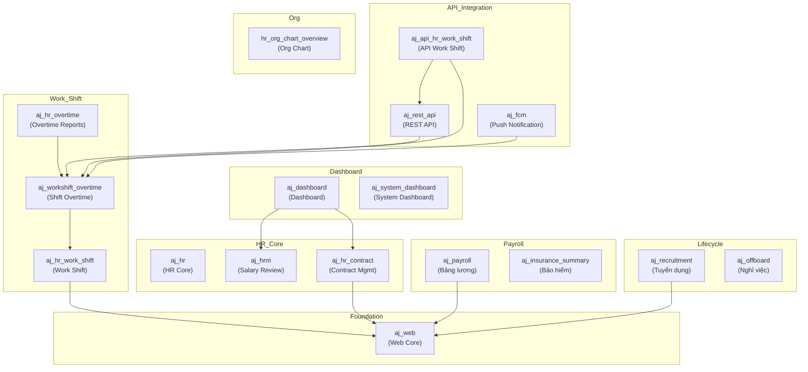
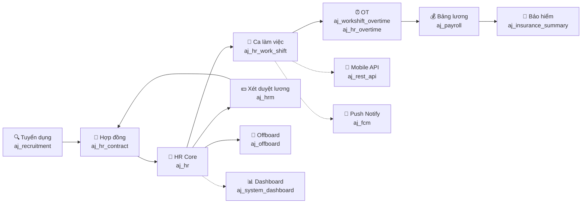

# Giải Thích Workflow Của Các Module AJ Addons

## Tổng Quan

`aj_addons` là bộ module **tùy chỉnh (customization) cho khách hàng AJ** dựa trên nền tảng Odoo. Các module này kế thừa (extend) từ các layer bên dưới: `bemo_addons` → `scg_addons` → `aj_addons`, tạo thành kiến trúc phân tầng.

## Sơ Đồ Phụ Thuộc Tổng Thể



---

## Chi Tiết Từng Module

---

### 1. `aj_web` — Web Foundation Layer
- **Phụ thuộc**: `bemo_web`, `bemo_hr_overtime`, `bemo_attendane_summary`
- **Vai trò**: Module nền tảng web, mở rộng module `web` của Odoo. Cung cấp:
  - Cấu hình tham số hệ thống (`ir_config_parameter`)
  - Nhóm bảo mật (`res_groups`)
  - Asset frontend (JS/CSS) tùy chỉnh
  - Settings cho company
- **`auto_install: True`** — Tự động cài khi dependencies có mặt

---

### 2. `aj_hr` — HR Core
- **Phụ thuộc**: `scg_hr`
- **Vai trò**: Module HR cốt lõi, quản lý tất cả quy trình HR
- **Models**: Kế thừa từ `scg_hr`, bổ sung sequence riêng cho AJ
- **Workflow**: Quản lý thông tin nhân sự cơ bản, tạo mã sequence HR

---

### 3. `aj_hrm` — Salary Review (Xét Duyệt Lương)
- **Phụ thuộc**: `scg_hrm`
- **Models chính**:
  - `aj_hr_salary_review` — Đợt xét duyệt lương
  - `aj_hr_salary_review_line` — Chi tiết từng nhân viên trong đợt xét duyệt
  - `hr_contract_appendix` — Phụ lục hợp đồng (liên kết kết quả xét duyệt)
  - `hr_contract_salary_rule` — Quy tắc lương theo hợp đồng
  - `hr_payslip_input` — Input bảng lương

**Workflow xét duyệt lương**:
```
Tạo đợt xét duyệt → Thêm nhân viên (wizard) → Xét duyệt từng dòng
→ Tạo phụ lục hợp đồng (wizard) → Xóa nhân viên (wizard) → Push sang payslip
```

Có 4 wizard hỗ trợ:
1. **Add Employee** — Thêm NV vào đợt review
2. **Create Contract Appendix** — Tạo phụ lục hợp đồng mới
3. **Delete Employee** — Xóa NV khỏi đợt review
4. **Push Other Payslip** — Đẩy kết quả sang bảng lương

---

### 4. `aj_hr_contract` — Contract Management (Quản Lý Hợp Đồng)
- **Phụ thuộc**: `aj_web`, `scg_hr_contract`
- **Models chính** (11 model):
  - `hr_contract` — Hợp đồng lao động
  - `hr_contract_appendix` — Phụ lục hợp đồng
  - `aj_hr_contract_evaluation` — Đánh giá hợp đồng (AJ custom)
  - `aj_hr_contract_evaluation_line` — Chi tiết đánh giá
  - `evaluation_criteria` / `evaluation_criteria_template` — Tiêu chí & mẫu đánh giá
  - `hr_contract_evaluation` — Đánh giá hợp đồng
  - `hr_employee` — Mở rộng thông tin nhân viên

**Workflow hợp đồng**:
```
Tạo HĐ → Cấu hình tiêu chí đánh giá (template) → Tạo đánh giá NV
→ Approve/Refuse (wizard) → Nhắc hạn HĐ sắp hết (cron) → In báo cáo
```

**Reports** (7 mẫu báo cáo):
- HĐ cấp L2, HĐ chính, HĐ thực tập, Phụ lục HĐ
- Đánh giá Manager / Staff / Operator

---

### 5. `aj_hr_work_shift` — Work Shift (Ca Làm Việc)
- **Phụ thuộc**: `mail`, `scg_recruitment`, `scg_payroll`, `scg_hr_overtime`, `web_widget_x2many_2d_matrix`, `aj_web`
- **Models chính** (32 model — module lớn nhất):

| Nhóm | Models |
|------|--------|
| **Booking** | `hr_booking_schedule`, `hr_booking_schedule_line` |
| **Attendance** | `hr_attendance`, `hr_attendance_log`, `hr_attendance_summary`, `hr_attendance_summary_day` |
| **Work Shift** | `hr_work_shift_attendance`, `hr_work_shift_attendance_change`, `hr_work_shift_attendance_summary`, `hr_work_shift_off`, `hr_work_shift_summary_day` |
| **Overtime** | `hr_overtime`, `hr_overtime_line`, `hr_overtime_type`, `hr_overtime_compensatory` |
| **Leave** | `hr_leave`, `hr_leave_allocation` |
| **Calendar** | `resource_calendar`, `resource_calendar_hour`, `resource_calendar_work_shift` |
| **Config** | `hr_work_shift_allowance_config`, `hr_job` |

**Workflow chấm công ca**:
```
Cấu hình lịch (resource_calendar) → Booking ca cho NV (hr_booking_schedule)
→ NV chấm công (hr_attendance) → So khớp với ca (hr_work_shift_attendance)
→ Xử lý thay đổi (hr_work_shift_attendance_change)
→ Tổng hợp ngày/tháng (summary_day → attendance_summary)
→ Tính phụ cấp ca (allowance_config)
→ Tích hợp bảng lương (hr_payslip)
```

**Wizards**: Book employee, Delete booking, Add booking, Copy schedule, Change booking, Change request

---

### 6. `aj_workshift_overtime` — Work Shift Overtime (OT Ca Làm Việc)
- **Phụ thuộc**: `bemo_web`, `aj_hr_work_shift`, `scg_time_off`, `queue_job`
- **Models chính** (15 model):
  - `hr_ws_overtime` — Đơn OT theo ca
  - `hr_ws_overtime_booking` — Booking OT
  - `hr_ws_overtime_type` — Loại OT
  - `hr_ws_overtime_line` — Chi tiết dòng OT
  - `hr_booking_schedule` — Mở rộng booking
  - Tích hợp `hr_payslip`, `hr_overtime`, `hr_over_shift`

**Workflow OT ca**:
```
Cấu hình loại OT (hr_ws_overtime_type) → Tạo booking OT (hr_ws_overtime_booking)
→ NV đăng ký OT (hr_ws_overtime) → Duyệt → Tính giờ OT
→ Tổng hợp vào payslip (hr_payslip_ot_line)
```

Sử dụng **`queue_job`** để xử lý bất đồng bộ cho các tác vụ nặng.

---

### 7. `aj_hr_overtime` — Overtime Reports (Báo Cáo OT)
- **Phụ thuộc**: `bemo_hr_overtime`, `scg_hr_overtime`, `aj_web`, `aj_workshift_overtime`
- **Vai trò**: Tầng báo cáo OT cuối cùng, chuyên về:
  - Báo cáo OT hàng tháng
  - Wizard export báo cáo OT
  - Security rules riêng cho AJ

---

### 8. `aj_recruitment` — Recruitment (Tuyển Dụng)
- **Phụ thuộc**: `bemo_hr_working_record`, `scg_recruitment`, `aj_web`
- **Models chính**:
  - `hr_recruitment_request` — Yêu cầu tuyển dụng
  - `hr_applicant` — Ứng viên
  - `hr_applicant_experience` — Kinh nghiệm ứng viên
  - `aj_recruitment_import_applicant` / `_line` — Import ứng viên hàng loạt
  - `hr_working_record` — Hồ sơ làm việc
  - `calendar_event` — Sự kiện phỏng vấn

**Workflow tuyển dụng**:
```
Tạo yêu cầu tuyển dụng (recruitment_request) → Phê duyệt
→ Quản lý ứng viên (applicant) → Import hàng loạt (import wizard)
→ Phỏng vấn (calendar_event) → Đánh giá → Nhận việc
→ Tạo hồ sơ NV & hợp đồng
```

---

### 9. `aj_offboard` — Offboard (Nghỉ Việc)
- **Phụ thuộc**: `scg_offboard`
- **Models chính**:
  - `hr_resignation_request` — Đơn xin nghỉ việc
  - `hr_resignation_decision` — Quyết định nghỉ việc

**Workflow nghỉ việc**:
```
NV nộp đơn nghỉ việc (resignation_request) → HR xem xét
→ Duyệt/Từ chối (refuse wizard) → Tạo quyết định (resignation_decision)
→ In báo cáo
```

---

### 10. `aj_payroll` — Payroll (Bảng Lương)
- **Phụ thuộc**: `scg_payroll`, `aj_web`
- **Models chính**:
  - `hr_payslip` — Phiếu lương
  - `hr_salary_rule` — Quy tắc tính lương
  - `hr_payroll_approval` — Phê duyệt bảng lương
  - `report_salary_analysis` — Phân tích lương

**Workflow bảng lương**:
```
Thu thập dữ liệu (HĐ, chấm công, OT, phụ cấp)
→ Tạo payslip → Tính lương theo salary_rule → Phê duyệt (hr_payroll_approval)
→ Xuất báo cáo phân tích lương
```

---

### 11. `aj_insurance_summary` — Insurance (Bảo Hiểm)
- **Phụ thuộc**: `scg_hr_insurance`, `scg_insurance_summary`, `scg_web`
- **Vai trò**: Quản lý thanh toán bảo hiểm hàng tháng
- Mở rộng: loại bảo hiểm, sổ bảo hiểm, tỷ lệ điều chỉnh

---

### 12. `aj_rest_api` — REST API
- **Phụ thuộc**: `scg_rest_api`, `aj_workshift_overtime`
- **Vai trò**: Cung cấp API schema cho mobile app/tích hợp bên ngoài
- **Schemas** cho 17 endpoint: booking schedule, attendance, overtime, leave, employee...

---

### 13. `aj_api_hr_work_shift` — API Work Shift Extension
- **Phụ thuộc**: `aj_rest_api`, `aj_workshift_overtime`
- **Vai trò**: Module API bổ sung cho Work Shift, cung cấp menu riêng

---

### 14. `aj_fcm` — FCM Push Notification
- **Phụ thuộc**: `bemo_fcm`, `hr_attendance`, `aj_workshift_overtime`
- **Vai trò**: Cấu hình gửi push notification (Firebase Cloud Messaging) cho các sự kiện:
  - OT được duyệt/thay đổi
  - Booking OT mới
  - Booking schedule thay đổi
  - Thay đổi ca chấm công
- Có cron job tự động gửi thông báo

---

### 15. `aj_dashboard` — Dashboard
- **Phụ thuộc**: `scg_dashboard`, `aj_hr_contract`, `aj_hrm`
- **Vai trò**: Hiển thị dashboard tổng hợp, link các action item từ contract & salary review

---

### 16. `aj_system_dashboard` — System Dashboard (Biểu Đồ Hệ Thống)
- **Phụ thuộc**: `scg_system_dashboard`
- **Vai trò**: Dashboard phân tích nhân sự toàn diện với **20+ biểu đồ**:

| Nhóm | Biểu đồ |
|------|---------|
| **Demographics** | Nam/Nữ, VN/Thai, Thế hệ, Thâm niên |
| **Workforce** | Vị trí, Loại HĐ, Giới tính theo Job |
| **Turnover** | Onboard/Offboard theo tháng/phòng ban, Tỷ lệ nghỉ việc, Lý do nghỉ |
| **Overtime** | OT theo tháng, Chi phí OT, Tuân thủ OT |
| **Leave** | Nghỉ phép theo phòng ban (bar + pie charts) |
| **Labor Cost** | Tổng chi phí nhân công, Lương theo job, Lương VN/expat theo tháng |

---

### 17. `hr_org_chart_overview` — Org Chart (Sơ Đồ Tổ Chức)
- **Phụ thuộc**: `hr`, `bemo_hr`
- **Nguồn gốc**: OCA (Odoo Community Association), bản 14.0
- **Vai trò**: Hiển thị sơ đồ tổ chức trực quan bằng QWeb template

---

## Workflow Tổng Thể (Vòng Đời Nhân Viên)



**Flow chính**:
1. **Tuyển dụng** (`aj_recruitment`) → Tạo yêu cầu, quản lý ứng viên, import hàng loạt
2. **Tạo hợp đồng** (`aj_hr_contract`) → Quản lý HĐ, phụ lục, đánh giá thử việc
3. **Quản lý NV** (`aj_hr`) → Thông tin cá nhân, mã NV
4. **Xếp ca** (`aj_hr_work_shift`) → Booking ca, chấm công, tổng hợp attendance
5. **Đăng ký OT** (`aj_workshift_overtime`) → Booking OT, duyệt, tính giờ
6. **Tính lương** (`aj_payroll`) → Tổng hợp từ HĐ + chấm công + OT → phiếu lương → duyệt
7. **Bảo hiểm** (`aj_insurance_summary`) → Theo dõi thanh toán BHXH hàng tháng
8. **Xét duyệt lương** (`aj_hrm`) → Batch review lương → tạo phụ lục HĐ mới
9. **Nghỉ việc** (`aj_offboard`) → Đơn xin nghỉ → quyết định → report

**Hỗ trợ xuyên suốt**:
- `aj_web` — UI/Security nền tảng
- `aj_rest_api` / `aj_api_hr_work_shift` — API cho mobile app
- `aj_fcm` — Push notification cho các sự kiện quan trọng
- `aj_dashboard` / `aj_system_dashboard` — Biểu đồ phân tích
- `hr_org_chart_overview` — Sơ đồ tổ chức
